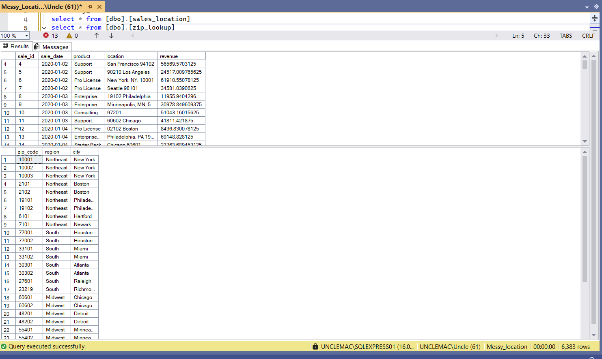
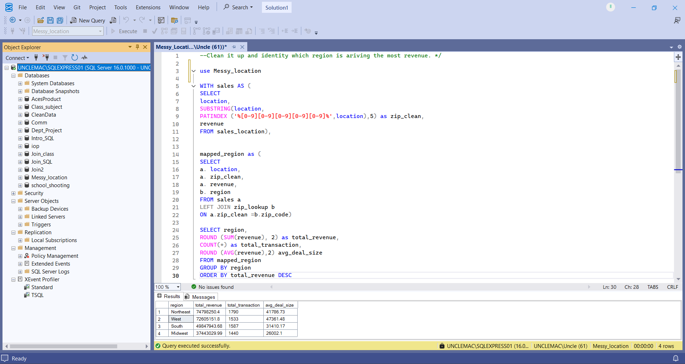

# SQL Data Cleaning & Revenue Analysis

## Problem Statement
The `location` column contained mixed ZIP codes, cities, and states in one field, making regional analysis difficult.
This project cleans the location data, extracts ZIP codes, maps each record to a region, and identifies which region generates the highest revenue.

## Files Included
* `sales_location.csv and Zip_lookup.csv` – Original dataset
* `cleaned-located.csv` – Cleaned dataset
* `sql_query.sql` – SQL solution

## SQL Skills Used
* CTEs
* LEFT JOIN
* Data Cleaning
* `SUBSTRING()`
* `PATINDEX()`
* `SUM()`, `COUNT()`, `AVG()`
* `GROUP BY`
* `ORDER BY`

## Process
1. Extracted ZIP codes from messy location text
2. Joined ZIP codes to region lookup table
3. Calculated total revenue by region
4. Ranked regions by revenue

## Key Insight
Identified the top-performing region driving the most revenue.

## Tools Used
* SSMS

## Screenshots
```md


```

